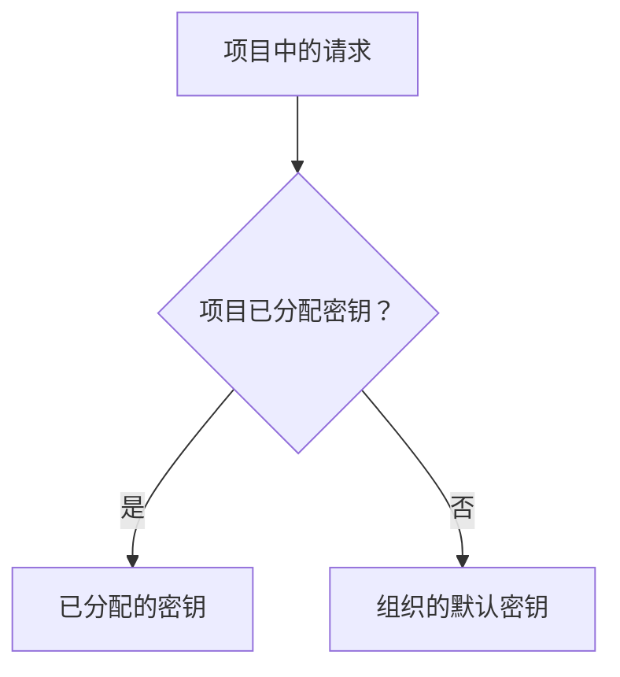

服务商密钥属于组织。除非为项目分配了其他密钥，每个项目都使用组织为该服务商设置的默认密钥。

## 添加密钥

打开组织的**服务商**页面，选择**添加密钥**。密钥发出的请求计入发送它们的密钥的[速率限制](keys-and-limits.md#速率限制)。

## 将密钥分配给项目

将密钥分配给应使用它的项目；其他项目继续使用默认密钥。

```mermaid
flowchart TD
  accTitle: 请求使用哪个提供商密钥
  accDescr: 请求使用分配给其项目的密钥，否则使用组织在该提供商的默认密钥。
  request[项目中的请求] --> assigned{项目已分配密钥？}
  assigned -- 是 --> own[已分配的密钥]
  assigned -- 否 --> fallback[组织的默认密钥]
```
